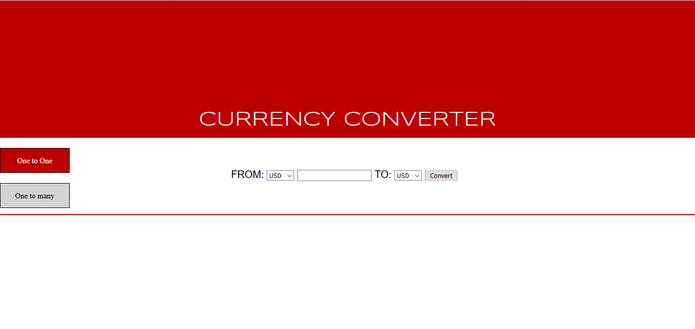

# Currency Converter
  This is a web based currency converter application. It was one of the projects of my CS425 (Web App Development) class. It is written 
  in Java 8 and uses java servlet for the back-end. The front end which is written in HTML and JavaScript/jQuery consists of a simple form
  UI via which an user can convert the currency. 
  
  
