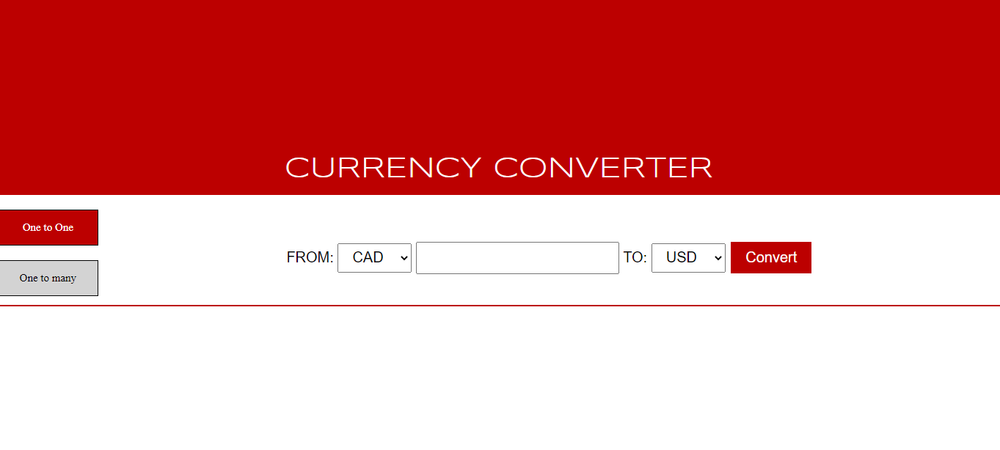
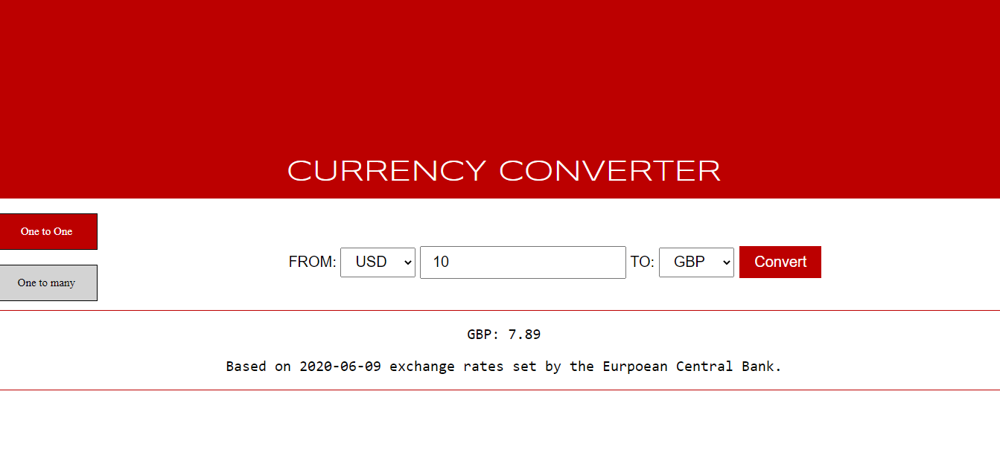
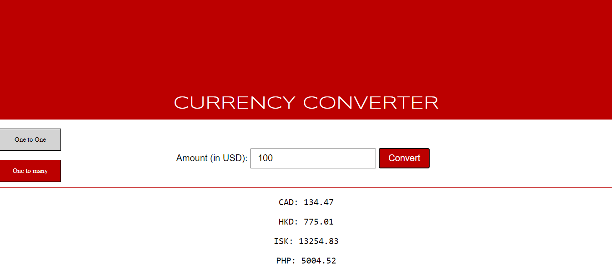

# Currency Converter
## Description
  This is a web based currency converter application. It is written in Java (Java 8 particularly) and uses java servlet, AJAX, and JavaScript for the back-end. The front end which is written in HTML and JavaScript/jQuery consists of a simple form user-interface via which an user can convert 33 different currencies. It consists of three branches namely,
  
  1. **master**
  2. **Database**
  3. **exchangeratesapi**
  
  ##
  In the **master/default** branch, the currency conversion rates are stored in a csv file. The currency conversion rates are first converted to a JSON string via **getRatesAsJson(List<String[]> csv) method**. The Latest class uses a java servlet to render the JSON string on the web. Finally, the AJAX method calls this API via **getConversion()** method to get the JSON data. Once the JSON data is processed, the currency conversion is performed by the **convert(rates)** method where rates is a JSON response gotten from the AJAX call.
  
  ##
  In the **Database** branch, the currency conversion rates are stored in a database file (Lab4b.sql). The currency conversion rates are first converted to a JSON string via **getRatesAsJson(String code) method** where code is a currency code like USD. The Latest class uses a java servlet to render the JSON string on the web. Finally, the AJAX method calls this API via **getConversion()** method to get the JSON data. Once the JSON data is processed, the currency conversion is performed by the **convert(rates)** method where rates is a JSON response gotten from the AJAX call.
  
  ##
  In the **exchangeratesapi** branch, the program calls **https://api.exchangeratesapi.io/latest?base=?** (? could be USD, GBP, CAD, etc) API which gives the currency conversion rates set by the European Central Bank. The response is a JSON string, and once the JSON data is parsed, the currency conversion is performed by the **convert(rates)** method. So, for the realtime currency conversion, please run this application via this branch.
  ##
  
  The start page looks like below,
  
  
  
  The UI to convert one currency to another currency looks like below,
  
  
  
  The UI to convert US dollar to other currencies looks like below,
  
  
  
  ##
## Structure
  The directory structure of the source code is as follows:

    project root     (root directory of project, "cs425-project2")
               |
                - src             (root directory of the source code)
               |    |           
               |    - java   (all packages go here)
               |    |     |
               |    |     - edu.jsu.mcis  
               |    |     |            |
               |    |     |            - Latest.java (Java Servlet which renders the JSON response on the web)
               |    |     |            |
               |    |     |            - Rates.java (Class responsible for converting the currency rates into JSON string)
               |     
                - web
                    |
                    - main
                    |     |
                    |     - Home.css (CSS file which adds decoration) 
                    |     |
                    |     - index.html (The main page) 
                    |     |
                    |     - rates.csv (CSV file which stores currency conversion rates) 
                    |
                    - META-INF
                    |        |
                    |        - context.xml (It adds resource for database pooling) 
                    |
                    - scripts
                    |      |
                    |      - Converter.js (JavaScript function responsible for implementing AJAX calls and currency conversion) 
                    |      |
                    |      - jquery-3.4.1.min (JQuery file to import JQuery functionalities) 
                    |
                    - WEB-INF
                    |      |
                    |      - web.xml (configuration of the Java Servlet called Latest) 
                    
##
##  Important Classes and their Methods
##
### Converter.js
   JavaScript function which is responsible for the AJAX calls to the internal and external API. It has following functions;
   ##
   i) **convert(rates)** = It is responsible for the currency conversion. The argument/parameter is the JSON response which consists the currency conversion rates.
   ##
   ii) **getConversion()** = It is responsible for the AJAX call to the servlet called Latest. Once the AJAX call is successful and gets the JSON response from the servlet, the convert(response) method is called. In the **exchangeratesapi**, the AJAX calls to the url https://api.exchangeratesapi.io/latest?base=? (? could be USD, GBP, CAD, etc). 
   ##
   iii) **getAllConversion()** = It is responsible for the AJAX call to the servlet called Latest. Once the AJAX call is successful and gets the JSON response from the servlet, all 33 of the currencies are converted relative to the USD. In the **exchangeratesapi**, the AJAX calls to the url https://api.exchangeratesapi.io/latest?base=USD.
##
### Rates Class
   It is responsible for converting either the CSV data or the Database data into the JSON string. It has following methods;
   ##
   i) **String getRatesAsJson(List<String[]> csv)** = It is responsible for converting the CSV data into the JSON string.
   ##
   ii) **String getRatesAsJson(String code)** = It is responsible for converting the Database data into the JSON string.
   ##
##
## Configuring the Database for the Database Pooling
   To run the **database** branch, you'll need to import the application database (**Lab4B.sql**). After importing the database, you'll need to create database account for it, and grant that account the appropriate permission in MySQL. To do this, please run the following command one by one from an SQL client while logged in to MySQL as root:
 ##
         source C:\USER\Desktop\Currency-Converter\Lab4B.sql ( It assumes the location of sql file is in Currency-Converter folder.)
         create user 'c_user'@'localhost' identified by 'pass_currency!';
         grant all on lab4b.* to 'c_user'@'localhost';
         flush privileges;

##
## Running this Project
   To run this project you'll need Java (particularly Java 8), Apache Tomcat Server, and Netbeans (MySQL optional). If you don't have these tools, you can install them as described here (https://github.com/sbanjara/RequiredTools-Installation). Once you have all these required tools, you can clone this repository by running this command,
   ##
                     git clone https://github.com/sbanjara/Currency-Converter
   ##
   Once this project is cloned in your workstation, you can open and run it in the Netbeans.
   
  
