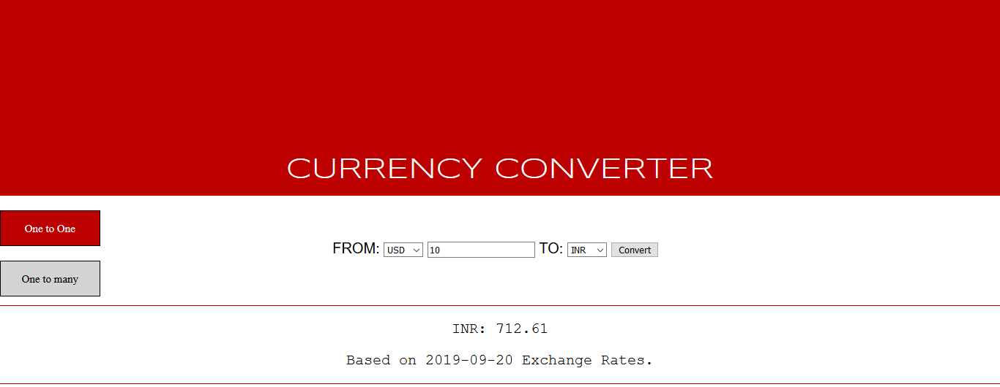
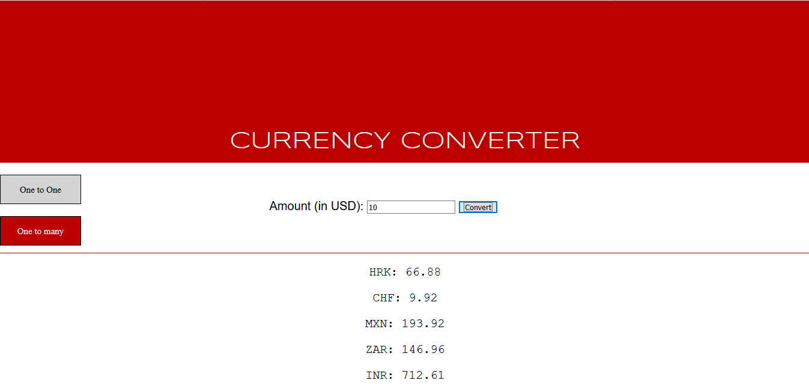

# Currency Converter
## Description
  This is a web based currency converter application. It was one of the projects of my CS425 (Web App Development) class. It is written 
  in Java (Java 8 particularly) and uses java servlet and AJAX for the back-end. The front end which is written in HTML and JavaScript/jQuery consists of a simple form UI via which an user can convert the currency. It consists of two branches namely,
  
  1. **master**
  2. **Database**
  
  In the **master/default** branch, the currency conversion rates are stored in a csv file whereas in the **Database** brach, the currency 
  conversion rates are stored in a database file (Lab4b.sql)
  
  The start page looks like below,
  
  
  
  The UI after converting from one currency to another currency looks like below,
  
  
  
  The UI after converting from US dollars to other currencies looks like below,
  
  
  
